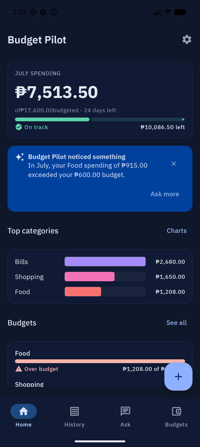
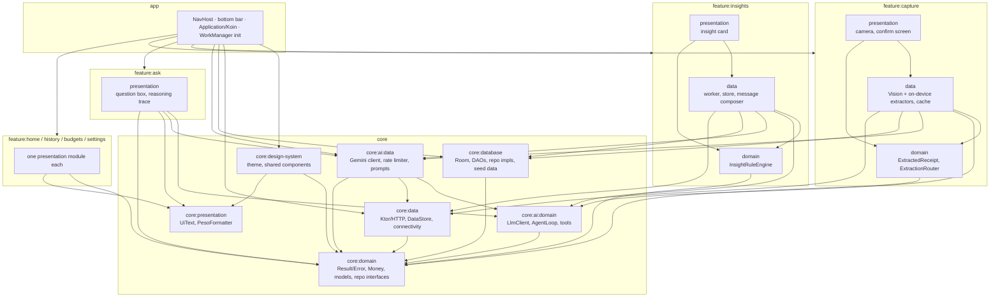
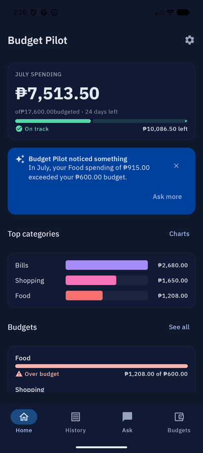
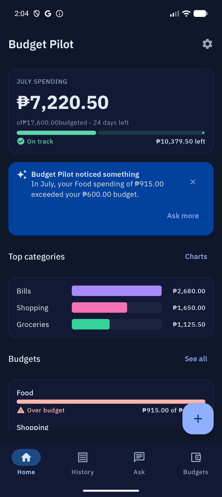
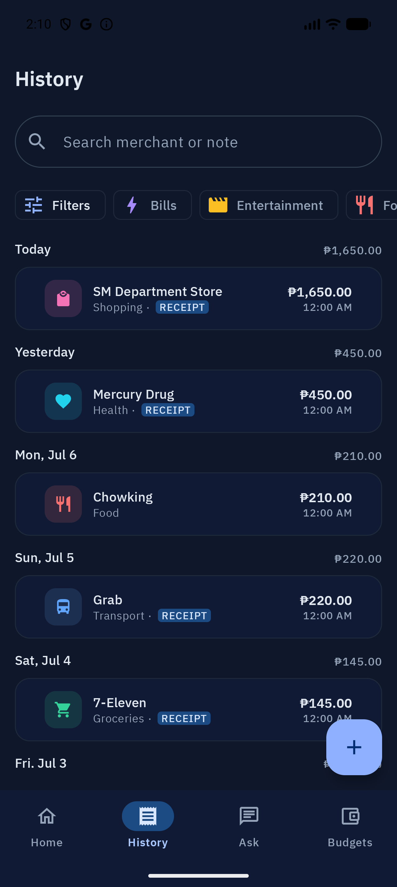
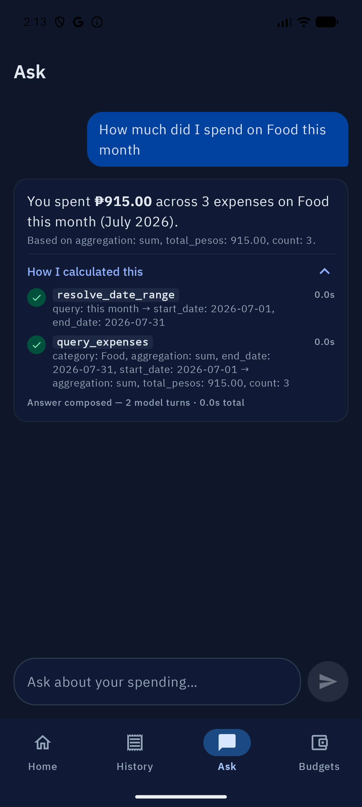
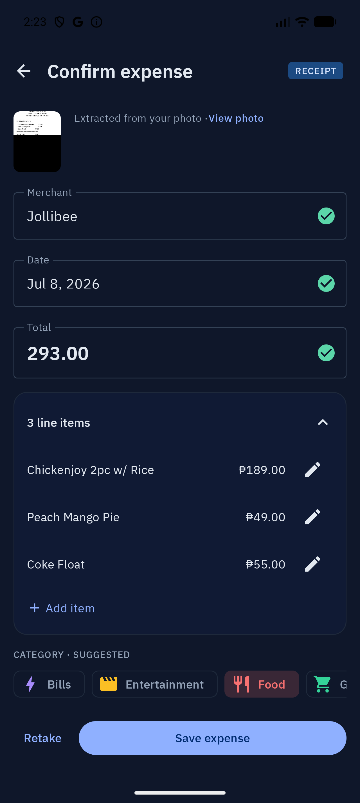
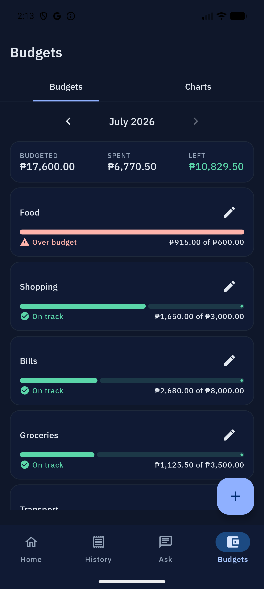
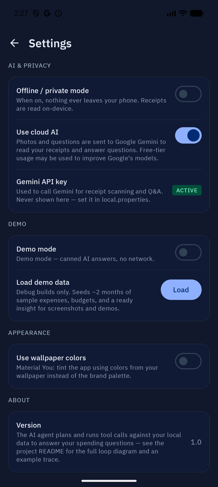

# Budget Pilot

[](https://github.com/maceljonray/budget-pilot/actions/workflows/ci.yml)


An AI-agent expense tracker — receipts, GCash/Maya screenshots, and cash
entries become structured spending data, and a tool-calling agent answers
natural-language questions about it by actually querying your local
database, not by guessing.

Every design decision below is explained, not just stated — the goal is a
genuinely agentic AI integration on solid modern Android foundations, not a
chat-wrapper demo.

<p align="center">
  
</p>

## Contents

- [Features](#features)
- [Architecture](#architecture)
- [How the agent works](#how-the-agent-works)
- [On-device vs. cloud](#on-device-vs-cloud)
- [Staying inside the free tier: rate limits & backoff](#staying-inside-the-free-tier-rate-limits--backoff)
- [Testing](#testing)
- [Setup](#setup)
- [Screenshots](#screenshots)

## Features

- **Capture** — photograph a receipt, pick one from the gallery, or hand it a
  GCash/Maya transaction screenshot. A vision LLM (or, offline, on-device OCR)
  returns merchant, date, line items, total, and a suggested category, each
  with its own confidence so low-confidence fields are flagged for you to
  double-check before anything is saved.
- **Manual entry** — a quick-add form for cash expenses with no receipt.
- **Ask** — a natural-language question box ("How much did I spend on food
  last month?"). The agent plans, runs read-only tools against your local
  data, and answers with the numbers it actually computed — with a "How I
  calculated this" trace you can expand to see every tool call.
- **Proactive insights** — on app open and via a periodic background check,
  deterministic rules decide *whether* something is worth surfacing (an
  over-budget category, an unusually large expense); an LLM call (with a
  template fallback) only phrases it. At most one insight, never spammy.
  Its "Ask more" button drops you into Ask with a question grounded in that
  same insight's actual numbers:

  <p align="center">
    
  </p>
- **Budgets & history** — monthly per-category budgets, a filterable expense
  history, and simple charts (horizontal bar by category, a 6-month line
  trend).
- **Privacy controls** — a visible offline/private-mode toggle that forces
  every AI path on-device, a demo mode that runs the whole app on scripted
  responses with zero network calls, and an optional Material You dynamic
  color toggle (default off).

## Architecture

Layered, multi-module Gradle project. The domain layer — including the agent
loop itself — has zero Android framework dependencies, so it's testable on
the plain JVM with no emulator.



**Dependency rules:** `presentation → domain ← data`; every module may see
`:core:domain`; feature modules never depend on each other (cross-feature
navigation goes through callbacks wired in `:app`). These are held as project
conventions (shared build configuration is centralized in `build-logic`
convention plugins, but dependency direction itself is enforced by review, not
tooling). `:feature:ask:presentation` is the one deliberate exception that
depends on `:core:ai:*` directly — it has no domain/data split of its own,
since wiring the agent loop *is* its whole job.

## How the agent works

The "Ask" agent is a tool-calling loop, not a single prompt-and-answer round
trip:

```
user question ──► LLM (system prompt + question + every tool's schema)
                    │
        ┌───────────┴────────────┐
        ▼                        ▼
  final text answer        one or more tool calls
        │                        │  executed locally: parameterized
        ▼                        │  Room queries, java.time date math
  answer + full trace            │  (never raw SQL from the model)
                                  ▼
                    results appended to the conversation
                    as structured "tool result" turns
                                  │
                                  └──► loop again (max 6 iterations)
```

`AgentLoop` is a plain suspend function over three injected interfaces
(`LlmClient`, a list of `AgentTool`s, and an injectable clock) — no Android
imports anywhere in it, which is what lets its whole test suite run in
milliseconds on the JVM. A handful of behaviors matter more than the happy
path:

- **Max 6 iterations**, then it gives up with a `MaxIterations` error — the
  agent can't spin forever burning API quota chasing its own tail.
- **A tool failing twice in a row aborts the run.** The first failure is fed
  back to the model as an error result, so it gets exactly one chance to
  adapt (different arguments, or a different tool) before the loop gives up.
- **An unknown tool name** — the model hallucinating a tool that doesn't
  exist — is fed back as an error result and is *not* counted as a failure;
  repeated hallucination is caught by the iteration cap instead, not this
  rule.
- **Every tool invocation is recorded**: name, arguments, a summary of the
  result, and how long it took (via the injected clock, so trace assertions
  in tests are deterministic instead of racing the wall clock). The Ask
  screen renders this behind a "How I calculated this" expander — the answer
  is auditable, not just asserted.

### The tools

Five tools, all **read-only** — the Q&A agent can never write to the
database (`save_expense` exists, but only in the capture-confirmation flow,
behind an explicit user tap):

| Tool | What it does |
|---|---|
| `query_expenses` | Filtered/aggregated expense queries (category, merchant, date range, sum/count/list) through a parameterized repository method. The model picks *which* query; it never writes SQL. |
| `get_budgets` | Budgets for a given `yyyy-MM` month. |
| `get_budget_status` | Spend-vs-budget per category for a month. |
| `get_categories` | The category list — name→id lookups are case-insensitive, and a miss returns the known category list so the model can self-correct instead of failing silently. |
| `resolve_date_range` | Turns "last month", "this week", "last 30 days", "June 2025" into concrete dates. This one is deterministic `java.time` code over an injected `Clock` — **no LLM call at all**. Date arithmetic is exactly the kind of thing LLMs get subtly wrong, so it isn't trusted to do it. |

### A real trace

This is the agent loop's own "happy path" test (`AgentLoopTest.kt`), not a
hand-written example — the loop mechanics, tool sequencing, and trace shape
below are exactly what the test suite asserts on:

> **User:** "How much did I spend on food?"
>
> 1. `query_expenses(...)` → `1500` — 250 ms
> 2. `get_budget_status(...)` → `"on_track"` — 350 ms
> 3. **Final answer:** "You spent ₱1,500 on food and are on track."

(The test exercises loop mechanics rather than realistic argument shapes, so
the tool calls above are simplified from what a live Gemini call actually
sends — the real `query_expenses` call carries a category, a resolved date
range, and an aggregation mode, as shown in the tools table above.)

This is that same trace, live against a real Gemini call and real local data —
`resolve_date_range` turning "this month" into concrete dates, then
`query_expenses` aggregating the actual seeded receipts:

<p align="center">
  
</p>

## On-device vs. cloud

Every receipt (and the Q&A agent) runs through one of two paths, and the
choice is a deliberate design trade-off, not just a fallback:

```
image ──► ExtractionRouter
            ├─ cloud AI allowed AND device is online ──► cloud vision LLM
            └─ otherwise ─────────────────────────────► on-device OCR
```

- **Cloud** (`VisionLlmExtractor`): the receipt photo plus a versioned prompt
  go to Gemini with a strict JSON response schema and four few-shot examples
  (a clean Jollibee receipt, a partly-smudged supermarket receipt that teaches
  the model to report honest low confidence, a GCash "Send Money" screenshot,
  and a Maya bill payment). If the response fails to parse, the extractor gets
  exactly one repair-prompt retry before giving up gracefully. Higher
  accuracy, especially on messy or unusual layouts, but needs network and
  sends the image off-device.
- **On-device** (`MlKitReceiptExtractor`): ML Kit's bundled (not the
  network-downloaded variant) Latin OCR model, feeding a pure-Kotlin,
  LLM-free parser (`ReceiptParser`) tuned for common local receipt and
  e-wallet layouts and
  table-driven-tested against nine real fixture receipts (Jollibee, SM,
  Puregold, 7-Eleven, Mercury Drug, GCash send, GCash bill pay, Maya, and a
  deliberately degraded-OCR case). Works with the phone in airplane mode,
  keeps every byte on the device, but is less accurate on unusual formats and
  never attempts itemized line items.

Both paths return the same `ExtractedReceipt` model, with every field
(merchant, date, total, line items, category) carrying its own
HIGH/MEDIUM/LOW confidence — the confirm screen highlights the low-confidence
ones so you know what to double-check, and nothing is ever saved without an
explicit confirm tap, regardless of which path produced it.

Which path runs is decided by exactly two things: whether Private Mode is on
(it forces on-device, full stop, and visibly disables the cloud toggle so
there's no ambiguity about where your data is going), and whether the device
is online. When a cloud call fails with a rate limit or network error, the
confirm screen offers "Use offline scan" as a one-tap retry through the
on-device path, alongside "Enter manually" — degrading gracefully is a
designed UI state, not an exception message.

> [!NOTE]
> Free-tier Gemini may use inputs to improve Google's models — this is why
> the private-mode toggle exists and is visible on the main Settings screen,
> not buried in an about page. The Gemini API key lives on-device, injected at
> build time from `local.properties` and kept out of version control; this is
> an acknowledged demo-app compromise (a client-side key can be extracted from
> the APK) — a production version of this app would proxy Gemini calls through
> a backend instead of shipping the key to the client at all.

## Staying inside the free tier: rate limits & backoff

The whole point of this project is that it costs nothing to run, which means
designing around Gemini's free-tier limits rather than hoping not to hit
them:

- **`RateLimiter`** enforces a minimum interval (6 seconds by default,
  matching roughly 10 requests/minute) between calls, mutex-guarded so
  concurrent callers queue instead of racing past the gate. It suspends
  rather than fires-and-hopes.
- **Retries**: up to 3, and only on HTTP 429 and 5xx — never on a successful
  response that simply failed to parse (`AiError.MalformedOutput` is never
  retried, since retrying an identical request that already parsed wrong just
  burns quota for the same result). Backoff is exponential — 1 s, 2 s, 4 s —
  with up to 250 ms of random jitter so several near-simultaneous retries
  don't all land on the same wall-clock tick. If the 429 response body
  carries Google's own `RetryInfo.retryDelay` hint, that server-provided
  delay wins over the computed backoff.
- **Extraction caching**: each extraction result is cached in Room keyed by
  the SHA-256 hash of the image bytes, so re-picking the exact same photo (a
  common thing to do while testing a demo) costs zero additional LLM calls.
- **Insight throttling**: at most one insight notification/card per 48 hours,
  and never the same insight type for the same month twice — this is a UX
  rule ("never spammy") that also happens to bound LLM usage for the
  insight-phrasing calls.
- **Billing is never enabled** on the backing Google Cloud project — enabling
  billing removes the free tier entirely for that project, so it's treated as
  a hard constraint, not an oversight.

## Testing

Fakes over mocks throughout — there's no mocking library in this project.
Roughly, by layer:

| Layer | Tooling | What's actually covered |
|---|---|---|
| Domain (pure Kotlin) | JUnit 5 + AssertK | `AgentLoop` (happy path, multi-tool sequences, the twice-in-a-row tool-failure abort, unknown-tool hallucination, max-iteration bailout, malformed output, deterministic trace durations), every agent tool including `resolve_date_range`'s full date grammar, `Money`/`BudgetMath`, `InsightRuleEngine`, `ReceiptParser` (table-driven over 9 fixture receipts). |
| Data | JUnit 5 + Ktor `MockEngine` / in-memory Room | `KtorGeminiLlmClient`'s retry/backoff behavior and `retryDelay`-hint precedence, DAOs, repositories, the extraction cache, the extraction router. |
| Presentation | JUnit 5 + Turbine + AssertK + fakes | Every ViewModel: state transitions, one-shot events, and error-path mapping. |
| UI (instrumented) | Compose `ComposeTestRule` + robot pattern, JUnit 4 | Three critical flows: expense list, capture confirm, and Ask (question → answer, trace expander, error states). |

> [!NOTE]
> **Known caveat, documented rather than hidden**: on the specific emulator
> image this project has been developed against (a Pixel 10 Pro / API 37
> preview AVD), Espresso can't inject touch input at all — not a bug in these
> tests, a toolchain limitation on that specific image. Those three
> instrumented suites are verified to compile and their logic is sound, but
> were confirmed working end-to-end via manual runs and screenshots on that
> image rather than via `connectedAndroidTest` there; they're expected to run
> normally on hardware or a less bleeding-edge AVD.

## Setup

1. Clone the repo and open it in a recent Android Studio that supports AGP
   9.2.1 / Kotlin 2.2.21 / JDK 21.
2. Get a **free** Gemini API key from [Google AI Studio](https://aistudio.google.com/).

   > [!IMPORTANT]
   > Do not enable billing on the backing Google Cloud project — that
   > removes the free tier entirely.

3. Add it to a `local.properties` file at the repo root (this file is
   gitignored and never committed):

   ```properties
   GEMINI_API_KEY=your-key-here
   ```

4. Build and run. Without a key, extraction and Ask calls fail gracefully
   with a "no API key" state; on-device OCR extraction, manual entry,
   budgets, history, and charts all work with no key at all.
5. On a debug build, Settings → Demo → **Load demo data** seeds ~2 months of
   realistic expenses, budgets, and a guaranteed over-budget insight in one
   tap — the fastest way to get the app into a demoable state (and how the
   screenshots and GIFs in this README were produced). The row is gated
   behind `BuildConfig.DEBUG` and never renders in a release build.
6. Useful Gradle tasks:

   ```
   ./gradlew test                 # unit tests, all modules
   ./gradlew connectedDebugAndroidTest   # instrumented UI tests (needs a device/emulator)
   ./gradlew ktlintCheck detekt lint     # static analysis
   ```

> [!NOTE]
> **Privacy**: with cloud AI on, receipt images and Ask questions are sent
> to Google's Gemini API; free-tier usage may be used by Google to improve
> their models. Turn on **Offline / private mode** in Settings to keep
> everything on-device — it's a first-class toggle on the main Settings screen,
> not an afterthought. **Demo mode** (also in Settings) runs the entire app
> against scripted responses with zero network calls, for offline
> demonstrations.

## Screenshots

The app ships one deliberate dark theme only — an earlier light theme was
removed outright rather than left half-supported, so there's no light-mode
set of screenshots to capture.

| Home | History | Ask |
|---|---|---|
|  |  |  |

| Capture confirm | Budgets & charts | Settings |
|---|---|---|
|  |  |  |
